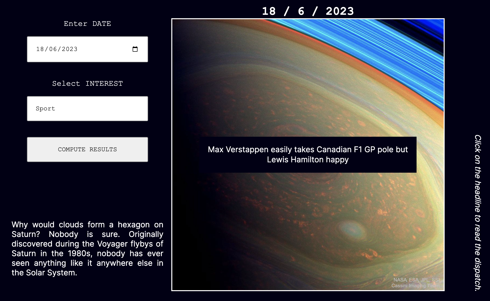
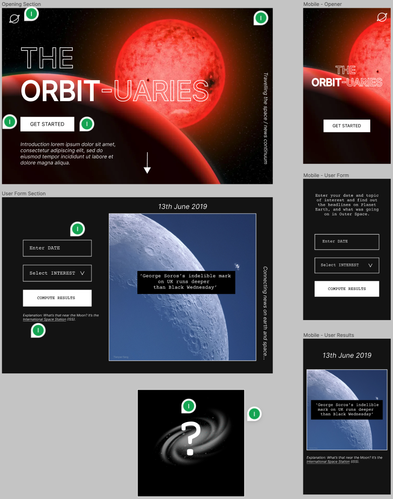

# HTTP Project: Space News Project

  

 

> “There is a theory which states that if ever anyone discovers exactly what the Universe is for and why it is here, it will instantly disappear and be replaced by something even more bizarre and inexplicable. There is another theory which states that this has already happened.”

— Douglas Adams

## Table of Contents:

1. [Introduction](#introduction)
2. [Repository Contents](#repository-contents)
3. [Project Objectives](#project-objectives)
4. [Planning](#planning)
5. [Compatibility](#compatibility)
6. [Authors](#authors)

## Introduction:
         
This repository holds a project built for juxtaposing space and earth stories and for practicing interacting with public APIs. Enter a date and a news category to generate the image. The APIs utlized in the website are NASA's apod API, The Guardian API, and Unsplash. 

View web page here: <a href="https://isobelbutler.github.io/Space-News-Project/" target="blank">isobelbutler.github.io/Space-News-Project/.</a>

## Repository Contents:

1. index.html - website HTML.
2. styles.css - the styles for the website.
3. index.js - website javascipt.
4. explanation-bug.js - javascript file coonatining a function to shorten the APOD's accompanying description.
5. images - folder containing all the images for the website.

## Project Objectives:

- [x] Query at least two APIs using fetch.
- [x] Dynamic content generated with JS.
- [x] Accessible and responsive mobile-first designed site.
- [x] Incorporate some indication that data is loading.
- [x] Incorporate error handling and display error when something goes wrong.

## Planning:

Figma was used to desing an initial layout.

Then we broke up the project into its main components and divided the workload evenly, focusing on the following tasks:

- Implementing responsive website CSS.
- Designing the NASA APOD API fetch function with error handling.
- Designing The Guardian API fetch function with error handling.

## Compatibility
The website is designed to be compatible with modern web browsers. It utilizes CSS media queries to provide a responsive layout across different computer and mobile phone screen sizes.

## Authors
[George Klemperer](https://www.github.com/GeorgeKlemperer)
 
[Isobel Butler](https://www.github.com/isobelbutler)

